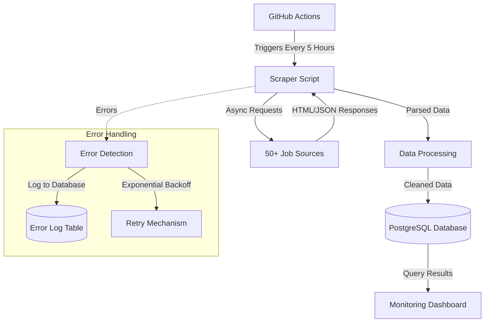
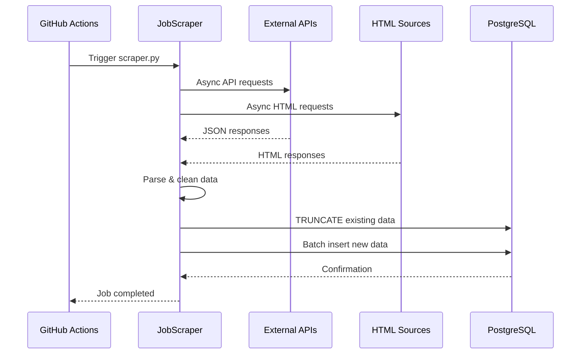
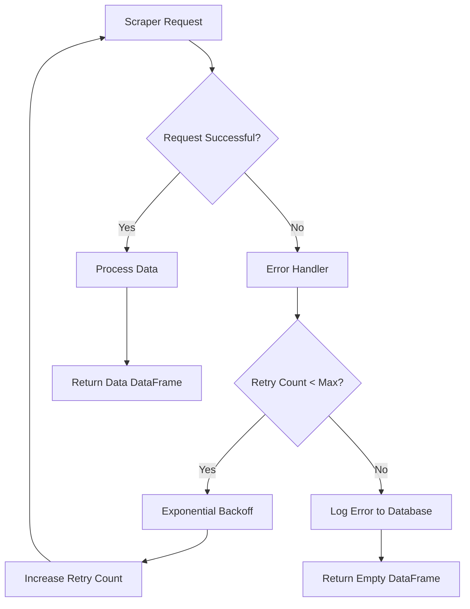
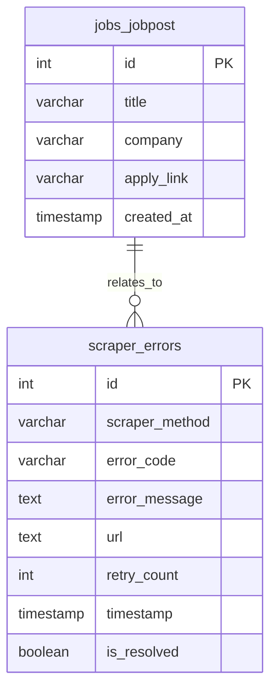
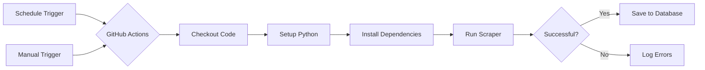
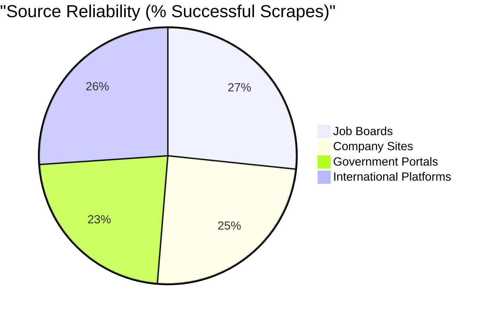

# JobScraping

A comprehensive job scraping system that aggregates job listings from 50+ employment websites in Azerbaijan and stores them in a centralized PostgreSQL database.


## Overview

This project automates the collection of job listings from various sources including:
- Company career pages (Azercell, ABB, Kapital Bank, etc.)
- Job aggregator sites (JobFinder, ProJobs, etc.)
- Government portals (CBAR, TABIB, etc.)
- International platforms (UN Jobs, The Muse, Djinni)

The scraper runs automatically every 5 hours via GitHub Actions and stores all job data in a PostgreSQL database with SSL encryption.

## System Architecture



## Features

- 🔄 **Automated Scraping**: Runs every 5 hours using GitHub Actions
- 🌐 **50+ Sources**: Covers major job boards and company career pages
- 🛡️ **Error Handling**: Comprehensive error logging and retry mechanisms
- 🔒 **SSL Encryption**: Secure database connections
- 📊 **Data Deduplication**: Prevents duplicate job listings
- 🚀 **Async Processing**: Efficient concurrent scraping with aiohttp
- 🔍 **Monitoring**: SQL query for tracking scraper health

## Data Flow



## Tech Stack

- **Python 3.8+**
- **aiohttp**: For asynchronous HTTP requests
- **BeautifulSoup4**: HTML parsing
- **pandas**: Data manipulation
- **psycopg2**: PostgreSQL database interface
- **GitHub Actions**: CI/CD and automation
- **PostgreSQL**: Data storage

## Error Handling Architecture



## Project Structure

```
.
├── .github/
│   └── workflows/
│       └── scraper.yml        # GitHub Actions workflow
├── scraper/
│   ├── requirements.txt       # Python dependencies
│   └── scraper.py            # Main scraper script
├── monitoring.sql            # Database monitoring query
├── .gitignore
└── README.md
```

## Installation

1. Clone the repository:
```bash
git clone https://github.com/Ismat-Samadov/birjobScraper.git
cd birjobScraper
```

2. Create a virtual environment:
```bash
python -m venv env
source env/bin/activate  # Linux/Mac
env\Scripts\activate     # Windows
```

3. Install dependencies:
```bash
pip install -r scraper/requirements.txt
```

4. Set up environment variables:
```bash
# Create .env file with these variables:
DB_HOST=your_db_host
DB_PORT=your_db_port
DB_USER=your_db_user
DB_PASSWORD=your_db_password
DB_NAME=your_db_name
EMAIL=your_email     # For sites requiring authentication
PASSWORD=your_password
```

## Database Schema



## Database Setup

The scraper expects a PostgreSQL database with the following schema:

```sql
CREATE TABLE jobs_jobpost (
    id SERIAL PRIMARY KEY,
    title VARCHAR(500),
    company VARCHAR(500),
    apply_link VARCHAR(1000),
    created_at TIMESTAMP DEFAULT CURRENT_TIMESTAMP
);

CREATE TABLE scraper_errors (
    id SERIAL PRIMARY KEY,
    scraper_method VARCHAR(255) NOT NULL,
    error_code VARCHAR(50) NOT NULL,
    error_message TEXT NOT NULL,
    url TEXT,
    retry_count INTEGER,
    timestamp TIMESTAMP DEFAULT CURRENT_TIMESTAMP,
    is_resolved BOOLEAN DEFAULT FALSE
);
```

## Running the Scraper

### Manual Execution

```bash
python scraper/scraper.py
```

### Automated Execution

The scraper runs automatically via GitHub Actions:
- **Schedule**: Every 5 hours
- **Manual Trigger**: Available through workflow_dispatch

## GitHub Actions Workflow



## Scraped Sources

The system scrapes from 50+ sources including:

### Job Boards
- 1is.az
- Banker.az
- Boss.az
- Djinni.co
- eJob.az
- Glorri
- HelloJob.az
- JobBox.az
- JobFinder.az
- JobSearch.az
- Offer.az
- Position.az
- ProJobs
- SmartJob.az
- Staffy.az
- Vakansiya.az
- Vakansiya.biz

### Company Career Pages
- ABB Bank
- ADA University
- ASCO
- Azercell
- Azerconnect
- AzerGold
- Azercosmos
- Baku Electronics
- Bank of Baku
- Bravo Supermarket
- CBAR
- Guavalab
- Kapital Bank
- Konsis

### Government & International
- ARTI (Education Institute)
- Azerbaijan Energy Regulatory Agency
- MDM (National Deposit Center)
- TABIB
- UN Jobs

## Error Handling

The scraper includes comprehensive error handling:
- Automatic retries with exponential backoff
- Error logging to database
- SSL certificate verification bypass for problematic sites
- Connection timeout management
- Rate limiting between requests

## Monitoring

Use the included `monitoring.sql` query to track scraper health:

```sql
-- See monitoring.sql for full query
-- Shows job counts and status for each source
```

## Development

### Adding a New Scraper

1. Create a new async method in `JobScraper` class
2. Use the `@scraper_error_handler` decorator
3. Return a pandas DataFrame with columns: `company`, `vacancy`, `apply_link`
4. Add the method to the `parsers` list in `get_data_async()`

Example:
```python
@scraper_error_handler
async def parse_new_site(self, session):
    url = "https://example.com/careers"
    response = await self.fetch_url_async(url, session)
    
    if response:
        soup = BeautifulSoup(response, 'html.parser')
        jobs = []
        
        # Parse job listings
        # ...
        
        return pd.DataFrame(jobs)
    
    return pd.DataFrame(columns=['company', 'vacancy', 'apply_link'])
```

### Best Practices

1. Use async/await for all HTTP requests
2. Handle SSL verification issues with `verify_ssl=False`
3. Implement rate limiting between requests
4. Use appropriate user-agent headers
5. Log errors without exposing sensitive data
6. Test locally before deploying

## GitHub Actions Setup

1. Add repository secrets:
   - `DB_HOST`
   - `DB_PORT`
   - `DB_USER`
   - `DB_PASSWORD`
   - `DB_NAME`
   - `EMAIL`
   - `PASSWORD`

2. The workflow automatically:
   - Sets up Python 3.8
   - Installs dependencies
   - Runs the scraper
   - Logs results to the database

## Contributing

1. Fork the repository
2. Create a feature branch
3. Add tests for new scrapers
4. Submit a pull request

## Troubleshooting

### Common Issues

1. **SSL Certificate Errors**
   - Solution: Use `verify_ssl=False` for problematic sites

2. **Connection Timeouts**
   - Solution: Increase timeout values in aiohttp.ClientTimeout

3. **Rate Limiting**
   - Solution: Add delays between requests using `asyncio.sleep()`

4. **Encoding Issues**
   - Solution: Use chardet to detect encoding

## Performance Metrics



## License

This project is open source and available under the MIT License.

## Acknowledgments

This project was built to help job seekers in Azerbaijan find opportunities across multiple platforms efficiently.