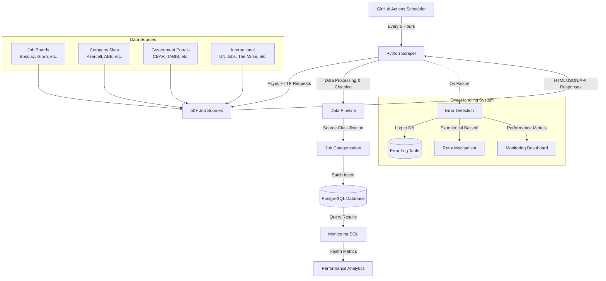

# birjobScraper - Azerbaijan Job Market Aggregator

A comprehensive, automated job scraping system that aggregates job listings from 50+ employment websites across Azerbaijan and stores them in a centralized PostgreSQL database with advanced error handling and monitoring.


## 🌟 Features

- **🤖 Automated Scraping**: Runs every 5 hours via GitHub Actions
- **🌐 50+ Job Sources**: Comprehensive coverage of Azerbaijan job market
- **🛡️ Robust Error Handling**: Advanced retry mechanisms with exponential backoff
- **📊 Source Classification**: Automatic categorization of job sources
- **🔒 Secure Database**: PostgreSQL with SSL encryption and dedicated schema
- **⚡ Async Processing**: High-performance concurrent scraping with aiohttp
- **📈 Real-time Monitoring**: SQL-based health monitoring and analytics
- **🔄 Data Deduplication**: Intelligent duplicate detection and removal
- **📝 Comprehensive Logging**: Detailed error tracking and performance metrics

## 🏗️ System Architecture



## 🌐 Supported Sources

### Job Boards & Aggregators (20+ sources)
- **1is.az** - General job board
- **Boss.az** - Popular job platform
- **Djinni.co** - Tech-focused jobs
- **eJob.az** - Employment portal
- **Glorri** - Modern job platform
- **HelloJob.az** - Professional network
- **JobBox.az** - Job aggregator
- **JobFinder.az** - Search platform
- **JobSearch.az** - Comprehensive listings
- **Offer.az** - Employment opportunities
- **Position.az** - Career platform
- **ProJobs** - Professional positions
- **SmartJob.az** - Smart matching
- **Staffy.az** - Staffing solutions
- **Vakansiya.az** - Vacancy portal
- **Vakansiya.biz** - Business jobs

### Banking & Finance (5+ sources)
- **ABB Bank** - Azerbaijan Banking careers
- **Bank of Baku** - Major bank positions
- **Banker.az** - Banking sector jobs
- **Kapital Bank** - Leading bank careers
- **CBAR** - Central Bank of Azerbaijan

### Government & Public Sector (8+ sources)
- **ARTI** - Education Institute positions
- **ASCO** - State Oil Company
- **Azerbaijan Energy Regulatory Agency** - Energy sector
- **CBAR** - Central Bank vacancies
- **ITS Gov** - Government IT services
- **MDM** - National Deposit Center
- **TABIB** - Healthcare authority
- **Oil Fund** - State Oil Fund positions

### Technology & Innovation (10+ sources)
- **Azercosmos** - Space technology
- **Azerconnect** - Telecommunications
- **CanScreen** - Tech screening
- **Fintech Farm** - Financial technology
- **Guavalab** - Innovation lab
- **Konsis** - IT solutions

### International & Remote (5+ sources)
- **Airswift** - Global energy jobs
- **DEJobs** - International opportunities
- **The Muse** - Remote positions
- **UN Jobs** - United Nations careers
- **Orion** - Global placements

### Corporate & Retail (5+ sources)
- **ADA University** - Academic positions
- **Azercell** - Telecom leader
- **AzerGold** - Mining company
- **Baku Electronics** - Electronics retail
- **Bravo Supermarket** - Retail chain

## 🛠️ Tech Stack

### Core Technologies
- **Python 3.8+** - Main programming language
- **aiohttp** - Async HTTP client for concurrent scraping
- **BeautifulSoup4** - HTML parsing and extraction
- **pandas** - Data manipulation and analysis
- **psycopg2** - PostgreSQL database adapter

### Infrastructure
- **PostgreSQL** - Primary database with SSL encryption
- **GitHub Actions** - CI/CD and automation platform
- **Docker** - Containerization (optional)

## 🗄️ Database Schema

The system uses a dedicated `scraper` schema in PostgreSQL:

```sql
-- Jobs table
CREATE TABLE scraper.jobs_jobpost (
    id SERIAL PRIMARY KEY,
    title VARCHAR(500) NOT NULL,
    company VARCHAR(500) NOT NULL,
    apply_link VARCHAR(1000) UNIQUE NOT NULL,
    source VARCHAR(100),
    created_at TIMESTAMP DEFAULT CURRENT_TIMESTAMP
);

-- Error tracking table
CREATE TABLE scraper.scraper_errors (
    id SERIAL PRIMARY KEY,
    source VARCHAR(255) NOT NULL,
    error TEXT NOT NULL,
    timestamp TIMESTAMP DEFAULT CURRENT_TIMESTAMP
);

-- Indexes for performance
CREATE INDEX idx_jobs_source ON scraper.jobs_jobpost(source);
CREATE INDEX idx_jobs_created_at ON scraper.jobs_jobpost(created_at);
CREATE INDEX idx_errors_source ON scraper.scraper_errors(source);
CREATE INDEX idx_errors_timestamp ON scraper.scraper_errors(timestamp);
```

### Database Migration

If migrating from the old schema, run the provided migration script:

```bash
psql -d your_database -f db/migration.sql
```

## 🚀 Installation

### Prerequisites
- Python 3.8 or higher
- PostgreSQL 12+ with SSL support
- Git

### Local Setup

1. **Clone the repository**
```bash
git clone https://github.com/Ismat-Samadov/birjobScraper.git
cd birjobScraper
```

2. **Create virtual environment**
```bash
python -m venv venv
source venv/bin/activate  # Linux/Mac
# or
venv\Scripts\activate     # Windows
```

3. **Install dependencies**
```bash
pip install -r scraper/requirements.txt
```

4. **Set up environment variables**
```bash
# Create .env file
cat > .env << EOF
DB_HOST=your_database_host
DB_PORT=5432
DB_USER=your_db_user
DB_PASSWORD=your_db_password
DB_NAME=your_db_name
EMAIL=your_email
PASSWORD=your_password
EOF
```

5. **Initialize database**
```bash
# Run the migration script to set up the schema
psql -d your_database -f db/migration.sql
```

6. **Test the scraper**
```bash
python scraper/scraper.py
```

## ⚙️ Configuration

### Environment Variables

| Variable | Description | Required |
|----------|-------------|----------|
| `DB_HOST` | PostgreSQL host address | Yes |
| `DB_PORT` | Database port (default: 5432) | Yes |
| `DB_USER` | Database username | Yes |
| `DB_PASSWORD` | Database password | Yes |
| `DB_NAME` | Database name | Yes |
| `EMAIL` | Email for sites requiring authentication | No |
| `PASSWORD` | Password for authenticated sites | No |

### Scraper Settings

The scraper can be configured by modifying `scraper/scraper.py`:

```python
# Connection settings
TIMEOUT = 60  # Request timeout in seconds
MAX_RETRIES = 3  # Maximum retry attempts
BATCH_SIZE = 100  # Database batch insert size

# Rate limiting
DELAY_BETWEEN_REQUESTS = 1  # Seconds between requests
BACKOFF_FACTOR = 2  # Exponential backoff multiplier
```

## 🎯 Usage

### Manual Execution

Run the scraper manually:

```bash
python scraper/scraper.py
```

### Automated Execution

The scraper runs automatically via GitHub Actions:
- **Schedule**: Every 5 hours
- **Manual trigger**: Available through GitHub Actions interface
- **Status**: Check Actions tab for execution logs

### Monitoring

Use the monitoring SQL query to check scraper health:

```bash
psql -d your_database -f db/monitoring.sql
```

This provides:
- Job count per source
- Source status (Active/Inactive)
- Latest scraping timestamps
- Sample job titles
- URL patterns for debugging

### Data Analysis

Example queries for data analysis:

```sql
-- Jobs added in the last 24 hours
SELECT source, COUNT(*) as new_jobs
FROM scraper.jobs_jobpost 
WHERE created_at > NOW() - INTERVAL '24 hours'
GROUP BY source
ORDER BY new_jobs DESC;

-- Most active companies
SELECT company, COUNT(*) as job_count
FROM scraper.jobs_jobpost
WHERE created_at > NOW() - INTERVAL '7 days'
GROUP BY company
ORDER BY job_count DESC
LIMIT 10;

-- Error analysis
SELECT source, COUNT(*) as error_count
FROM scraper.scraper_errors
WHERE timestamp > NOW() - INTERVAL '24 hours'
GROUP BY source
ORDER BY error_count DESC;
```

## 🏗️ System Architecture


## 🌐 Supported Sources

### Job Boards & Aggregators (20+ sources)
- **1is.az** - General job board
- **Boss.az** - Popular job platform
- **Djinni.co** - Tech-focused jobs
- **eJob.az** - Employment portal
- **Glorri** - Modern job platform
- **HelloJob.az** - Professional network
- **JobBox.az** - Job aggregator
- **JobFinder.az** - Search platform
- **JobSearch.az** - Comprehensive listings
- **Offer.az** - Employment opportunities
- **Position.az** - Career platform
- **ProJobs** - Professional positions
- **SmartJob.az** - Smart matching
- **Staffy.az** - Staffing solutions
- **Vakansiya.az** - Vacancy portal
- **Vakansiya.biz** - Business jobs

### Banking & Finance (5+ sources)
- **ABB Bank** - Azerbaijan Banking careers
- **Bank of Baku** - Major bank positions
- **Banker.az** - Banking sector jobs
- **Kapital Bank** - Leading bank careers
- **CBAR** - Central Bank of Azerbaijan

### Government & Public Sector (8+ sources)
- **ARTI** - Education Institute positions
- **ASCO** - State Oil Company
- **Azerbaijan Energy Regulatory Agency** - Energy sector
- **CBAR** - Central Bank vacancies
- **ITS Gov** - Government IT services
- **MDM** - National Deposit Center
- **TABIB** - Healthcare authority
- **Oil Fund** - State Oil Fund positions

### Technology & Innovation (10+ sources)
- **Azercosmos** - Space technology
- **Azerconnect** - Telecommunications
- **CanScreen** - Tech screening
- **Fintech Farm** - Financial technology
- **Guavalab** - Innovation lab
- **Konsis** - IT solutions

### International & Remote (5+ sources)
- **Airswift** - Global energy jobs
- **DEJobs** - International opportunities
- **The Muse** - Remote positions
- **UN Jobs** - United Nations careers
- **Orion** - Global placements

### Corporate & Retail (5+ sources)
- **ADA University** - Academic positions
- **Azercell** - Telecom leader
- **AzerGold** - Mining company
- **Baku Electronics** - Electronics retail
- **Bravo Supermarket** - Retail chain

## 🛠️ Tech Stack

### Core Technologies
- **Python 3.8+** - Main programming language
- **aiohttp** - Async HTTP client for concurrent scraping
- **BeautifulSoup4** - HTML parsing and extraction
- **pandas** - Data manipulation and analysis
- **psycopg2** - PostgreSQL database adapter

### Infrastructure
- **PostgreSQL** - Primary database with SSL encryption
- **GitHub Actions** - CI/CD and automation platform
- **Docker** - Containerization (optional)

### Monitoring & Analytics
- **SQL Analytics** - Custom monitoring queries
- **Error Tracking** - Database-driven error logging
- **Performance Metrics** - Scraping success rates

## 🗄️ Database Schema

The system uses a dedicated `scraper` schema in PostgreSQL:

```sql
-- Jobs table
CREATE TABLE scraper.jobs_jobpost (
    id SERIAL PRIMARY KEY,
    title VARCHAR(500) NOT NULL,
    company VARCHAR(500) NOT NULL,
    apply_link VARCHAR(1000) UNIQUE NOT NULL,
    source VARCHAR(100),
    created_at TIMESTAMP DEFAULT CURRENT_TIMESTAMP
);

-- Error tracking table
CREATE TABLE scraper.scraper_errors (
    id SERIAL PRIMARY KEY,
    source VARCHAR(255) NOT NULL,
    error TEXT NOT NULL,
    timestamp TIMESTAMP DEFAULT CURRENT_TIMESTAMP
);

-- Indexes for performance
CREATE INDEX idx_jobs_source ON scraper.jobs_jobpost(source);
CREATE INDEX idx_jobs_created_at ON scraper.jobs_jobpost(created_at);
CREATE INDEX idx_errors_source ON scraper.scraper_errors(source);
CREATE INDEX idx_errors_timestamp ON scraper.scraper_errors(timestamp);
```

### Database Migration

If migrating from the old schema, run the provided migration script:

```bash
psql -d your_database -f db/migration.sql
```

## 🚀 Installation

### Prerequisites
- Python 3.8 or higher
- PostgreSQL 12+ with SSL support
- Git

### Local Setup

1. **Clone the repository**
```bash
git clone https://github.com/Ismat-Samadov/birjobScraper.git
cd birjobScraper
```

2. **Create virtual environment**
```bash
python -m venv venv
source venv/bin/activate  # Linux/Mac
# or
venv\Scripts\activate     # Windows
```

3. **Install dependencies**
```bash
pip install -r scraper/requirements.txt
```

4. **Set up environment variables**
```bash
# Create .env file
cat > .env << EOF
DB_HOST=your_database_host
DB_PORT=5432
DB_USER=your_db_user
DB_PASSWORD=your_db_password
DB_NAME=your_db_name
EMAIL=your_email
PASSWORD=your_password
EOF
```

5. **Initialize database**
```bash
# Run the migration script to set up the schema
psql -d your_database -f db/migration.sql
```

6. **Test the scraper**
```bash
python scraper/scraper.py
```

## ⚙️ Configuration

### Environment Variables

| Variable | Description | Required |
|----------|-------------|----------|
| `DB_HOST` | PostgreSQL host address | Yes |
| `DB_PORT` | Database port (default: 5432) | Yes |
| `DB_USER` | Database username | Yes |
| `DB_PASSWORD` | Database password | Yes |
| `DB_NAME` | Database name | Yes |
| `EMAIL` | Email for sites requiring authentication | No |
| `PASSWORD` | Password for authenticated sites | No |

### Scraper Settings

The scraper can be configured by modifying `scraper/scraper.py`:

```python
# Connection settings
TIMEOUT = 60  # Request timeout in seconds
MAX_RETRIES = 3  # Maximum retry attempts
BATCH_SIZE = 100  # Database batch insert size

# Rate limiting
DELAY_BETWEEN_REQUESTS = 1  # Seconds between requests
BACKOFF_FACTOR = 2  # Exponential backoff multiplier
```

## 🎯 Usage

### Manual Execution

Run the scraper manually:

```bash
python scraper/scraper.py
```

### Automated Execution

The scraper runs automatically via GitHub Actions:
- **Schedule**: Every 5 hours
- **Manual trigger**: Available through GitHub Actions interface
- **Status**: Check Actions tab for execution logs

### Monitoring

Use the monitoring SQL query to check scraper health:

```bash
psql -d your_database -f db/monitoring.sql
```

This provides:
- Job count per source
- Source status (Active/Inactive)
- Latest scraping timestamps
- Sample job titles
- URL patterns for debugging

### Data Analysis

Example queries for data analysis:

```sql
-- Jobs added in the last 24 hours
SELECT source, COUNT(*) as new_jobs
FROM scraper.jobs_jobpost 
WHERE created_at > NOW() - INTERVAL '24 hours'
GROUP BY source
ORDER BY new_jobs DESC;

-- Most active companies
SELECT company, COUNT(*) as job_count
FROM scraper.jobs_jobpost
WHERE created_at > NOW() - INTERVAL '7 days'
GROUP BY company
ORDER BY job_count DESC
LIMIT 10;

-- Error analysis
SELECT source, COUNT(*) as error_count
FROM scraper.scraper_errors
WHERE timestamp > NOW() - INTERVAL '24 hours'
GROUP BY source
ORDER BY error_count DESC;
```

## 📊 Monitoring

### Health Dashboard

The system includes comprehensive monitoring capabilities:

1. **Source Health Monitoring**
   - Active vs inactive sources
   - Job counts per source
   - Last successful scrape timestamps

2. **Error Tracking**
   - Error rates by source
   - Error categorization
   - Historical error trends

3. **Performance Metrics**
   - Scraping duration
   - Success rates
   - Data quality metrics

### Monitoring Query

Run the monitoring script to get a comprehensive overview:

```bash
# Get detailed source status
psql -d your_database -f db/monitoring.sql

# Check recent errors
psql -d your_database -c "
SELECT source, COUNT(*) as errors, MAX(timestamp) as latest_error
FROM scraper.scraper_errors 
WHERE timestamp > NOW() - INTERVAL '24 hours'
GROUP BY source
ORDER BY errors DESC;
"
```

## 🔧 GitHub Actions Setup

### Repository Secrets

Add the following secrets to your GitHub repository:

1. Go to Settings → Secrets and variables → Actions
2. Add these repository secrets:

```
DB_HOST: your_database_host
DB_PORT: your_database_port
DB_USER: your_database_username
DB_PASSWORD: your_database_password
DB_NAME: your_database_name
EMAIL: your_email_for_authentication
PASSWORD: your_password_for_authentication
```

### Workflow Configuration

The workflow automatically:
- Sets up Python 3.8 environment
- Installs all dependencies
- Runs the scraper
- Logs results and errors

### Manual Triggering

Trigger the scraper manually:
1. Go to Actions tab in GitHub
2. Select "Scheduled Scraper Job"
3. Click "Run workflow"

## 👨‍💻 Development

### Adding New Scrapers

1. **Create a new scraper method**:

```python
@scraper_error_handler
async def parse_new_site(self, session):
    """
    Scraper for NewSite.com
    """
    url = "https://newsite.com/careers"
    response = await self.fetch_url_async(url, session)
    
    if response:
        soup = BeautifulSoup(response, 'html.parser')
        jobs = []
        
        for job_element in soup.find_all('div', class_='job-item'):
            title = job_element.find('h3').text.strip()
            company = job_element.find('span', class_='company').text.strip()
            link = job_element.find('a')['href']
            
            jobs.append({
                'company': company,
                'vacancy': title,
                'apply_link': link
            })
        
        return pd.DataFrame(jobs)
    
    return pd.DataFrame(columns=['company', 'vacancy', 'apply_link'])
```

2. **Add to parser list**:

```python
# In get_data_async method
parsers = [
    # ... existing parsers
    self.parse_new_site(session),
]
```

3. **Update monitoring patterns**:

```sql
-- Add to website_patterns in monitoring.sql
('NewSite', '%newsite.com%'),
```

### Development Best Practices

1. **Error Handling**: Always use `@scraper_error_handler` decorator
2. **Rate Limiting**: Add delays between requests
3. **SSL Handling**: Use `verify_ssl=False` for problematic sites
4. **User Agents**: Rotate user agents to avoid blocking
5. **Testing**: Test locally before deploying

### Code Quality

```bash
# Format code
black scraper/scraper.py

# Check for issues
flake8 scraper/scraper.py

# Type checking
mypy scraper/scraper.py
```

## 📡 API Reference

### Core Classes

#### JobScraper

Main scraper class with the following key methods:

```python
class JobScraper:
    def __init__(self):
        """Initialize scraper with database credentials"""
    
    async def get_data_async(self):
        """Execute all scrapers concurrently"""
    
    async def fetch_url_async(self, url, session, **kwargs):
        """Fetch URL with retry logic and error handling"""
    
    def save_to_db(self, df, batch_size=100):
        """Save scraped data to PostgreSQL database"""
    
    async def log_scraper_error(self, scraper_method, error_code, error_message, **kwargs):
        """Log errors to database for monitoring"""
```

### Scraper Methods

Each source has a dedicated scraper method following this pattern:

```python
@scraper_error_handler
async def parse_source_name(self, session):
    """
    Returns: pandas.DataFrame with columns ['company', 'vacancy', 'apply_link']
    """
```

## 🔧 Troubleshooting

### Common Issues

#### 1. SSL Certificate Errors
```python
# Solution: Disable SSL verification
response = await self.fetch_url_async(url, session, verify_ssl=False)
```

#### 2. Connection Timeouts
```python
# Solution: Increase timeout values
timeout = aiohttp.ClientTimeout(total=60, connect=20)
```

#### 3. Rate Limiting
```python
# Solution: Add delays between requests
await asyncio.sleep(random.uniform(1, 3))
```

#### 4. Database Connection Issues
```bash
# Check database connectivity
psql -h $DB_HOST -p $DB_PORT -U $DB_USER -d $DB_NAME -c "SELECT 1;"
```

#### 5. Memory Issues
```python
# Solution: Process data in smaller batches
batch_size = 50  # Reduce from default 100
```

### Debugging

Enable debug logging:

```python
import logging
logging.basicConfig(level=logging.DEBUG)
```

Check scraper health:

```bash
# Monitor recent activity
python -c "
import psycopg2
from scraper.scraper import JobScraper
scraper = JobScraper()
conn = psycopg2.connect(**scraper.db_params)
cur = conn.cursor()
cur.execute('SELECT COUNT(*) FROM scraper.jobs_jobpost WHERE created_at > NOW() - INTERVAL \\'1 hour\\'')
print(f'Jobs scraped in last hour: {cur.fetchone()[0]}')
"
```

### Performance Optimization

1. **Concurrent Requests**: Adjust session limits
2. **Database Indexing**: Ensure proper indexes exist
3. **Memory Management**: Monitor memory usage during scraping
4. **Network Optimization**: Use connection pooling

## 🤝 Contributing

### Getting Started

1. Fork the repository
2. Create a feature branch: `git checkout -b feature/new-scraper`
3. Make your changes
4. Test thoroughly
5. Submit a pull request

### Contribution Guidelines

1. **Code Style**: Follow PEP 8 guidelines
2. **Error Handling**: Use the provided error handling decorators
3. **Testing**: Test all new scrapers locally
4. **Documentation**: Update README and add docstrings
5. **Monitoring**: Add monitoring patterns for new sources

### Pull Request Process

1. Ensure all tests pass
2. Update documentation
3. Add monitoring support
4. Test with sample data
5. Submit detailed PR description

## 📄 License

This project is licensed under the MIT License - see the [LICENSE](LICENSE) file for details.

## 🙏 Acknowledgments

- Built for the Azerbaijan job market community
- Thanks to all contributors and maintainers
- Special recognition to the open-source libraries that make this possible

## 📞 Support

- **Issues**: [GitHub Issues](https://github.com/Ismat-Samadov/birjobScraper/issues)
- **Discussions**: [GitHub Discussions](https://github.com/Ismat-Samadov/birjobScraper/discussions)
- **Email**: Create an issue for support requests

---

**Made with ❤️ for Azerbaijan's job seekers**