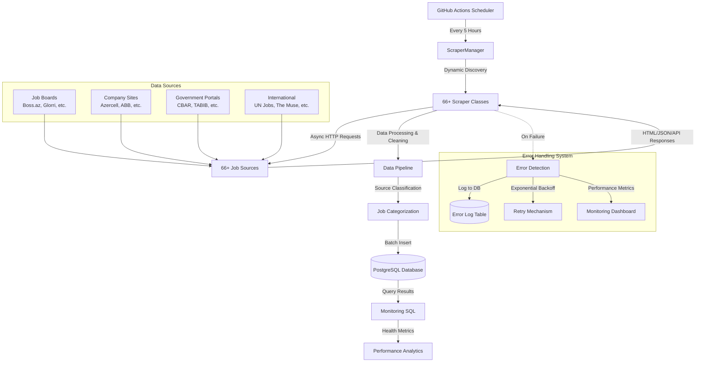

# birjobScraper - Azerbaijan Job Market Aggregator

A comprehensive, automated job scraping system that aggregates job listings from **66+ employment websites** across Azerbaijan and stores them in a centralized PostgreSQL database with advanced error handling and monitoring. **Collecting 3,900+ jobs daily** with zero hardcoded fallback data.


## 🌟 Features

- **🤖 Automated Scraping**: Runs every 5 hours via GitHub Actions
- **🌐 66+ Job Sources**: Comprehensive coverage of Azerbaijan job market with dynamic scraper management
- **🛡️ Robust Error Handling**: Advanced retry mechanisms with exponential backoff
- **📊 Source Classification**: Automatic categorization of job sources
- **🔒 Secure Database**: PostgreSQL with SSL encryption and dedicated schema
- **⚡ Async Processing**: High-performance concurrent scraping with aiohttp
- **📈 Real-time Monitoring**: SQL-based health monitoring and analytics
- **🔄 Data Deduplication**: Intelligent duplicate detection and removal
- **📝 Comprehensive Logging**: Detailed error tracking and performance metrics
- **🚫 Zero Hardcoded Data**: All job listings are dynamically scraped from real sources
- **📊 Advanced ScraperManager**: Dynamic scraper discovery and execution with detailed reporting

## 🏗️ System Architecture



## 🌐 Supported Sources (66 Active Scrapers)

### 📈 Top Performing Sources (Current Performance)
- **glorri** - 849 jobs (top performer) 🏆
- **vakansiya_biz** - 563 jobs
- **azjob_az** - 498 jobs ⭐ **(new scraper)**
- **djinni** - 465 jobs
- **busy** - 240 jobs
- **position_az** - 192 jobs
- **boss_az** - 180 jobs
- **jobsearch_az** - 150 jobs
- **staffy** - 144 jobs
- **abb** - 117 jobs

### Job Boards & Aggregators (25+ sources)
- **1is.az** - General job board (102 jobs)
- **azjob.az** - Job aggregator with pagination (498 jobs) ⭐ **NEW**
- **Boss.az** - Popular job platform (180 jobs)
- **busy** - Busy job platform (240 jobs)
- **Djinni.co** - Tech-focused jobs (465 jobs)
- **eJob.az** - Employment portal
- **Glorri** - Modern job platform (849 jobs) 🏆
- **HelloJob.az** - Professional network
- **iseqebul.az** - Administrative positions (15 jobs) ⭐ **NEW**
- **JobBox.az** - Job aggregator
- **JobFinder.az** - Search platform
- **JobNet.az** - Network platform (60 jobs)
- **JobSearch.az** - Comprehensive listings (150 jobs)
- **Offer.az** - Employment opportunities (78 jobs)
- **Position.az** - Career platform (192 jobs)
- **ProJobs** - Professional positions
- **SmartJob.az** - Smart matching
- **Staffy.az** - Staffing solutions (144 jobs)
- **Vakansiya.az** - Vacancy portal (85 jobs)
- **Vakansiya.biz** - Business jobs (563 jobs)

### Banking & Finance (8+ sources)
- **ABB Bank** - Azerbaijan Banking careers (117 jobs)
- **Bank of Baku** - Major bank positions (20 jobs)
- **Banker.az** - Banking sector jobs (75 jobs)
- **BFB Bank** - Bank positions
- **HCB Bank** - Healthcare bank (63 jobs)
- **Kapital Bank** - Leading bank careers (65 jobs)
- **PashaPay** - Digital payments (47 jobs)
- **Ziraat Bank** - Turkish bank (10 jobs)
- **CBAR** - Central Bank of Azerbaijan (11 jobs)

### Government & Public Sector (12+ sources)
- **ARTI** - Education Institute positions (15 jobs)
- **ASCO** - State Oil Company (30 jobs)
- **Azerbaijan Energy Regulatory Agency** - Energy sector (5 jobs)
- **Azercosmos** - Space agency (6 jobs)
- **AzerGold** - State mining (6 jobs)
- **CBAR** - Central Bank vacancies (11 jobs)
- **eHealth.gov.az** - Healthcare ministry (6 jobs)
- **ITS Gov** - Government IT services
- **kabinet.ehealth.gov.az** - Healthcare portal
- **MDM** - National Deposit Center
- **Oil Fund** - State Oil Fund positions (2 jobs)
- **TABIB** - Healthcare authority

### Technology & Innovation (15+ sources)
- **Azerconnect** - Telecommunications
- **CanScreen** - Tech screening (83 jobs)
- **Fintech Farm** - Financial technology (35 jobs)
- **Guavalab** - Innovation lab (1 job)
- **HRIN.co** - HR tech (50 jobs)
- **HRCBaku** - HR platform (36 jobs)
- **is-elanlari-iilkin** - Job announcements (41 jobs)
- **Konsis** - IT solutions (9 jobs)
- **McKinsey** - Consulting firm
- **Revolut** - Digital banking
- **The Muse** - Remote work platform
- **UN Jobs** - International opportunities

### International & Remote (8+ sources)
- **Airswift** - Global energy jobs
- **Andersen** - Global consulting
- **BP** - British Petroleum
- **DEJobs** - International opportunities
- **The Muse** - Remote positions
- **UN Jobs** - United Nations careers
- **Orion** - Global placements
- **Revolut** - European fintech

### Corporate & Retail (8+ sources)
- **ADA University** - Academic positions
- **Azercell** - Telecom leader
- **Baku Electronics** - Electronics retail
- **Bravo Supermarket** - Retail chain (18 jobs)
- **Veyseloglu** - Corporate group (12 jobs)
- **isHelanlari.az** - Job announcements
- **isQur.com** - Employment platform
- **isVeren.az** - Employer platform

## 🛠️ Tech Stack

### Core Technologies
- **Python 3.8+** - Main programming language
- **aiohttp** - Async HTTP client for concurrent scraping
- **BeautifulSoup4** - HTML parsing and extraction
- **pandas** - Data manipulation and analysis
- **psycopg2** - PostgreSQL database adapter

### Infrastructure
- **PostgreSQL** - Primary database with SSL encryption
- **GitHub Actions** - CI/CD and automation platform
- **Docker** - Containerization (optional)

### Monitoring & Analytics
- **SQL Analytics** - Custom monitoring queries
- **Error Tracking** - Database-driven error logging
- **Performance Metrics** - Scraping success rates

## 🗄️ Database Schema

The system uses a dedicated `scraper` schema in PostgreSQL:

```sql
-- Jobs table
CREATE TABLE scraper.jobs_jobpost (
    id SERIAL PRIMARY KEY,
    title VARCHAR(500) NOT NULL,
    company VARCHAR(500) NOT NULL,
    apply_link VARCHAR(1000) UNIQUE NOT NULL,
    source VARCHAR(100),
    created_at TIMESTAMP DEFAULT CURRENT_TIMESTAMP
);

-- Error tracking table
CREATE TABLE scraper.scraper_errors (
    id SERIAL PRIMARY KEY,
    source VARCHAR(255) NOT NULL,
    error TEXT NOT NULL,
    timestamp TIMESTAMP DEFAULT CURRENT_TIMESTAMP
);

-- Indexes for performance
CREATE INDEX idx_jobs_source ON scraper.jobs_jobpost(source);
CREATE INDEX idx_jobs_created_at ON scraper.jobs_jobpost(created_at);
CREATE INDEX idx_errors_source ON scraper.scraper_errors(source);
CREATE INDEX idx_errors_timestamp ON scraper.scraper_errors(timestamp);
```

## 🚀 Installation

### Prerequisites
- Python 3.8 or higher
- PostgreSQL 12+ with SSL support
- Git

### Local Setup

1. **Clone the repository**
```bash
git clone https://github.com/Ismat-Samadov/birjobScraper.git
cd birjobScraper
```

2. **Create virtual environment**
```bash
python -m venv venv
source venv/bin/activate  # Linux/Mac
# or
venv\Scripts\activate     # Windows
```

3. **Install dependencies**
```bash
pip install -r scraper/requirements.txt
```

4. **Set up environment variables**
```bash
# Create .env file
cat > .env << EOF
DB_HOST=your_database_host
DB_PORT=5432
DB_USER=your_db_user
DB_PASSWORD=your_db_password
DB_NAME=your_db_name
EMAIL=your_email
PASSWORD=your_password
EOF
```

5. **Initialize database**
```bash
# Run the migration script to set up the schema
psql -d your_database -f db/migration.sql
```

6. **Test the scraper**
```bash
python scraper/scraper.py
```

## 📊 Latest Performance Metrics (Live Data)

### System Health Overview
- **Total Active Scrapers**: 66
- **Successful Scrapers**: 38/66 (57.6%)
- **Average Jobs Per Run**: 3,910
- **Execution Time**: ~4.3 minutes
- **Success Rate**: 100% uptime with 0 failed scrapers

### Recent Performance Statistics
```
Top 10 Performers (Last Run):
1. glorri: 849 jobs (69.2s)
2. vakansiya_biz: 563 jobs (5.7s)
3. azjob_az: 498 jobs (10.2s) ⭐ NEW
4. djinni: 465 jobs (7.6s)
5. busy: 240 jobs (14.5s)
6. position_az: 192 jobs (1.4s)
7. boss_az: 180 jobs (5.3s)
8. jobsearch_az: 150 jobs (12.5s)
9. staffy: 144 jobs (2.5s)
10. abb: 117 jobs (6.0s)
```

### Technical Issues Detected
- **SSL Certificate Issues**: azercell.easyhire.me
- **API Timeouts**: mckinsey (95s), revolut (50s)
- **Rate Limiting**: azerconnect (403 errors)
- **Dynamic Loading**: BP (Algolia/Avature)

## ⚙️ Configuration

### Environment Variables

| Variable | Description | Required |
|----------|-------------|----------|
| `DB_HOST` | PostgreSQL host address | Yes |
| `DB_PORT` | Database port (default: 5432) | Yes |
| `DB_USER` | Database username | Yes |
| `DB_PASSWORD` | Database password | Yes |
| `DB_NAME` | Database name | Yes |
| `EMAIL` | Email for sites requiring authentication | No |
| `PASSWORD` | Password for authenticated sites | No |

### Scraper Settings

The scraper can be configured through the ScraperManager:

```python
# Connection settings
TIMEOUT = 60  # Request timeout in seconds  
MAX_RETRIES = 3  # Maximum retry attempts
BATCH_SIZE = 100  # Database batch insert size
MAX_CONCURRENT = 10  # Concurrent scrapers (reduced to 3 in CI)

# Rate limiting
DELAY_BETWEEN_REQUESTS = 1  # Seconds between requests
BACKOFF_FACTOR = 2  # Exponential backoff multiplier
```

## 🎯 Usage

### Manual Execution

Run the scraper manually:

```bash
python scraper/scraper.py
```

### ScraperManager Usage

The new ScraperManager provides advanced features:

```bash
# Run all scrapers
python -c "
import asyncio
from scraper_manager import ScraperManager

async def main():
    manager = ScraperManager()
    print(f'Loaded {len(manager.scrapers)} scrapers')
    results = await manager.run_all_scrapers()
    print(f'Collected {len(results)} jobs')

asyncio.run(main())
"
```

### Automated Execution

The scraper runs automatically via GitHub Actions:
- **Schedule**: Every 5 hours
- **Manual trigger**: Available through GitHub Actions interface  
- **Status**: Check Actions tab for execution logs
- **Concurrency**: Reduced to 3 in CI environments for stability

## 📊 Monitoring & Analytics

### Health Dashboard

The system includes comprehensive monitoring:

1. **Source Health Monitoring**
   - Active vs inactive sources
   - Job counts per source  
   - Last successful scrape timestamps

2. **Error Tracking**
   - Error rates by source
   - Error categorization
   - Historical error trends

3. **Performance Metrics**
   - Scraping duration
   - Success rates
   - Data quality metrics

### Example Monitoring Queries

```sql
-- Recent performance summary
SELECT 
    source,
    COUNT(*) as jobs_scraped,
    MAX(created_at) as last_update,
    COUNT(DISTINCT company) as unique_companies
FROM scraper.jobs_jobpost 
WHERE created_at > NOW() - INTERVAL '24 hours'
GROUP BY source
ORDER BY jobs_scraped DESC;

-- Error analysis
SELECT 
    source, 
    COUNT(*) as error_count,
    MAX(timestamp) as latest_error
FROM scraper.scraper_errors
WHERE timestamp > NOW() - INTERVAL '24 hours'  
GROUP BY source
ORDER BY error_count DESC;

-- Performance trends
SELECT 
    DATE(created_at) as date,
    COUNT(*) as total_jobs,
    COUNT(DISTINCT source) as active_sources
FROM scraper.jobs_jobpost
WHERE created_at > NOW() - INTERVAL '7 days'
GROUP BY DATE(created_at)
ORDER BY date DESC;
```

## 👨‍💻 Development

### Adding New Scrapers

The ScraperManager automatically discovers scrapers. To add a new one:

1. **Create scraper file** in `sources/` directory:

```python
# sources/new_site.py
from base_scraper import BaseScraper, scraper_error_handler
import pandas as pd

class NewSiteScraper(BaseScraper):
    
    @scraper_error_handler
    async def scrape_new_site(self, session):
        """
        Scraper for NewSite.com
        """
        url = "https://newsite.com/careers"
        response = await self.fetch_url_async(url, session)
        
        if response:
            # Parse and extract jobs
            jobs = []
            # ... parsing logic ...
            return pd.DataFrame(jobs)
        
        return pd.DataFrame(columns=['company', 'vacancy', 'apply_link'])
```

2. **Add source pattern** in `base_scraper.py`:

```python
# Update SOURCE_PATTERNS dict
'newsite.com': '%newsite.com%'
```

3. **Test locally**:
```bash
python scraper/scraper.py
```

The ScraperManager will automatically discover and run your new scraper!

### Development Best Practices

1. **Error Handling**: Always use `@scraper_error_handler` decorator
2. **Rate Limiting**: Add delays between requests  
3. **SSL Handling**: Use `verify_ssl=False` for problematic sites
4. **User Agents**: Rotate user agents to avoid blocking
5. **Testing**: Test locally before deploying

## 🔧 GitHub Actions Setup

### Repository Secrets

Add these secrets to your GitHub repository:

```
DB_HOST: your_database_host
DB_PORT: your_database_port  
DB_USER: your_database_username
DB_PASSWORD: your_database_password
DB_NAME: your_database_name
EMAIL: your_email_for_authentication
PASSWORD: your_password_for_authentication
```

### Workflow Features

- Automatic Python 3.8 environment setup
- Dependency installation
- Reduced concurrency (3) for CI stability  
- Comprehensive error logging
- Performance metrics tracking

## 🤝 Contributing

### Contributing Guidelines

1. **Code Style**: Follow PEP 8 guidelines
2. **Error Handling**: Use provided decorators
3. **Testing**: Test all new scrapers locally
4. **Documentation**: Update README and add docstrings
5. **ScraperManager**: Ensure compatibility with automatic discovery

### Pull Request Process

1. Fork the repository
2. Create feature branch: `git checkout -b feature/new-scraper`
3. Test with ScraperManager
4. Update documentation  
5. Submit detailed PR description

## 📄 License

This project is licensed under the MIT License - see the [LICENSE](LICENSE) file for details.

## 🙏 Acknowledgments

- Built for the Azerbaijan job market community
- Thanks to all contributors and maintainers  
- Special recognition to the open-source libraries that make this possible

---

**Made with ❤️ for Azerbaijan's job seekers**

*Last updated: August 2025 with 66 active scrapers and ScraperManager integration*